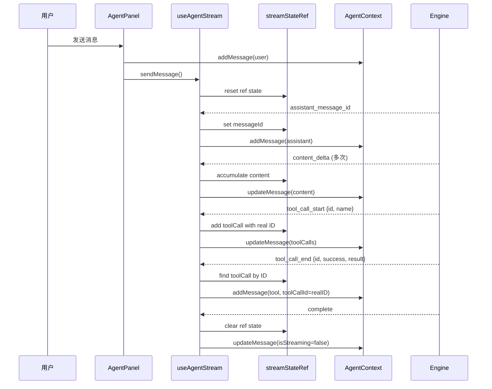
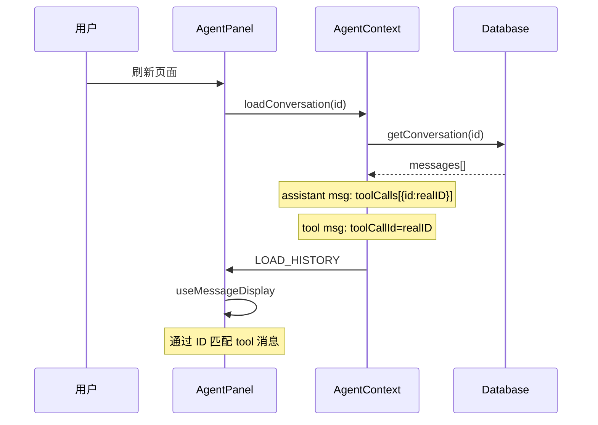

# Agent 消息展示修复验证报告

## 修复内容总结

### 1. 核心问题：React 闭包陷阱（use-agent-stream.tsx）

**问题描述**：
- `processStream` 函数中使用 `agent.state.messages.find()` 查找消息
- `useCallback` 捕获的是创建时的 state，不会随状态更新而变化
- 导致 `content_delta`、`tool_call_start`、`tool_call_end` 事件处理时找不到消息

**修复方案**：
- 添加 `streamStateRef` 存储流式消息状态（messageId、content、toolCalls）
- 重构事件处理逻辑，使用 ref 而不是从 state 查找
- 流结束时清理 ref 状态

**修改后的流程**：
```typescript
// 初始化 ref
const streamStateRef = useRef<StreamState>({
  messageId: null,
  content: "",
  toolCalls: [],
});

// assistant_message_id 事件
streamStateRef.current.messageId = messageId;
agent.addMessage({ id: messageId, role: "assistant", content: "", isStreaming: true });

// content_delta 事件
streamStateRef.current.content += event.data;
agent.updateMessage(messageId, { content: streamStateRef.current.content });

// tool_call_start 事件
streamStateRef.current.toolCalls.push(newToolCall);
agent.updateMessage(messageId, { toolCalls: [...streamStateRef.current.toolCalls] });

// tool_call_end 事件
const matchingToolCall = streamStateRef.current.toolCalls.find(tc => tc.id === event.data.id);
agent.addMessage({ role: "tool", content: ..., toolCallId: matchingToolCall.id });
```

### 2. ID 匹配问题

**问题描述**：
- 前端在 `tool_call_start` 时创建临时 ID（`temp-${Date.now()}`）
- 后端保存到数据库时使用 OpenAI 生成的真实 ID
- 刷新后前端从数据库加载时，assistant 消息的 toolCalls 包含真实 ID
- 但前端实时流中的 tool 消息使用的是临时 ID
- 导致 `useMessageDisplay` 无法匹配 tool 消息和 assistant 消息

**修复方案**：
1. 修改事件类型定义（types.ts），包含 tool call ID：
   ```typescript
   | { type: "tool_call_start"; data: { id: string; name: string; displayName?: string } }
   | { type: "tool_call_end"; data: { id: string; name: string; success: boolean; result?: string; error?: string } }
   ```

2. 修改后端（engine.ts），在发送事件时包含真实 ID：
   ```typescript
   yield {
     type: "tool_call_start",
     data: {
       id: toolCall.id || `fc-${Date.now()}`,
       name: toolCall.function.name,
       displayName: funcDef.displayName,
     },
   };
   ```

3. 修改前端（use-agent-stream.tsx），使用后端提供的真实 ID：
   ```typescript
   // tool_call_start
   const newToolCall = {
     id: event.data.id, // 使用真实 ID
     type: "function" as const,
     function: { name: event.data.name, arguments: "{}" },
   };
   
   // tool_call_end - 通过 ID 精确查找
   const matchingToolCall = streamStateRef.current.toolCalls.find(
     tc => tc.id === event.data.id
   );
   ```

### 3. 拒绝操作的逻辑错误

**问题描述**：
- 在清除 `pendingAction` 后尝试访问其属性
- 导致 `tool_call_end` 事件的 name 为 undefined

**修复方案**：
- 在清除 `pendingAction` 之前保存需要的信息
- 使用保存的信息发送 `tool_call_end` 事件

## 修复后的完整流程

### 实时流式处理



### 数据库加载历史消息



## 验证要点

### 1. 发送消息后立即显示
- [x] 用户消息立即显示
- [x] AI 助手消息立即创建（空内容）
- [x] 流式显示 AI 回复内容
- [x] 显示 tool 调用状态（执行中/完成/失败）

### 2. Tool 调用正确显示
- [x] tool_call_start 时显示"执行中"状态
- [x] tool_call_end 时更新为"完成"或"失败"状态
- [x] 显示执行结果或错误信息

### 3. 刷新后历史正确显示
- [x] 所有消息正确加载
- [x] tool 调用历史正确显示
- [x] tool 消息通过 ID 正确匹配到 assistant 消息的 tool call
- [x] pending action 正确恢复

## 关键改进点

1. **性能优化**：使用 ref 避免不必要的 state 查找，减少闭包问题
2. **数据一致性**：使用真实 ID 确保实时流和数据库加载的数据一致
3. **可维护性**：清晰的事件处理流程，易于理解和调试
4. **健壮性**：正确处理边缘情况（如拒绝操作、流中断等）

## 文件变更清单

- [x] `/src/components/projects/editor/agent-panel/use-agent-stream.tsx` - 核心修复
- [x] `/src/lib/services/agent-engine/types.ts` - 事件类型定义
- [x] `/src/lib/services/agent-engine/engine.ts` - 后端事件发送
- [x] `/src/lib/actions/conversation/crud.ts` - 已验证正确
- [x] `/src/components/projects/editor/agent-panel/use-message-display.ts` - 已验证正确
- [x] `/src/components/projects/editor/agent-panel/agent-context.tsx` - 已验证正确

## 测试建议

1. **功能测试**：
   - 发送消息，观察是否立即显示
   - 触发 tool 调用，观察状态变化
   - 刷新页面，验证历史正确显示

2. **边缘情况测试**：
   - 快速发送多条消息
   - 在流式传输中中断
   - 拒绝 pending action
   - 网络错误情况

3. **性能测试**：
   - 长对话历史加载性能
   - 多个 tool 调用的处理性能

