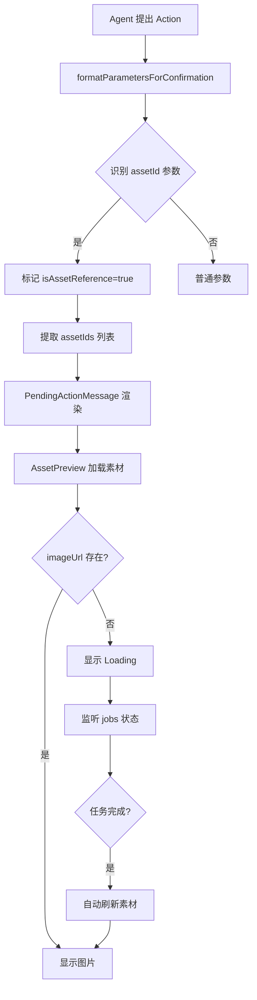

# Agent Action 素材图片展示优化 - 实现总结

## 实现内容

### 1. 扩展参数格式化器 (`src/lib/utils/agent-params-formatter.ts`)

**新增功能：**
- 添加 `isAssetReference` 和 `assetIds` 字段到 `FormattedParameter` 接口
- 新增 `isAssetReferenceParam()` 函数：识别所有以 `assetId` 或 `assetIds` 结尾的参数
- 新增 `extractAssetIds()` 函数：从各种格式（数组、字符串、JSON）中提取 assetId 列表
- 更新 `formatParametersForConfirmation()`：自动标记素材引用参数并提取 assetIds

**支持的参数：**
- `assetId` - 单个素材ID
- `assetIds` - 素材ID数组
- `imageAssetId` - 关联素材ID（用于 update_shot）
- `sourceAssetIds` - 参考图ID数组
- 任何以 `assetId(s)` 结尾的参数

### 2. 增强素材预览组件 (`src/components/projects/editor/agent-panel/pending-action-message.tsx`)

**新增 `AssetPreview` 组件：**
- 加载并显示素材图片
- 支持图片未生成状态（显示 loading spinner）
- **自动刷新机制**：监听 Editor Context 的 jobs 状态
  - 当检测到 `asset_image_generation` 任务完成时
  - 自动重新加载相关素材数据
  - 无需用户手动刷新

**向后兼容：**
- 保留 `ReferenceImages` 作为 `AssetPreview` 的别名
- 现有代码无需修改

### 3. 集成到待确认 Action 卡片

**自动展示所有素材引用：**
- 遍历所有格式化参数
- 对于 `isAssetReference === true` 的参数
- 自动显示素材预览网格
- 支持单个素材和多个素材

## 工作流程



## 测试场景

### 场景 1: update_shot 带 imageAssetId（图片已生成）
1. Agent 提出更新分镜，参数包含 `imageAssetId`
2. 待确认卡片应显示：
   - 参数：关联素材
   - 素材预览：显示素材图片（64x64）

### 场景 2: update_shot 带 imageAssetId（图片生成中）
1. Agent 提出更新分镜，参数包含刚生成的 `imageAssetId`
2. 待确认卡片应显示：
   - 参数：关联素材
   - 素材预览：显示 loading spinner
3. 等待几秒后，图片生成完成
4. **预览应自动更新为实际图片**（无需刷新页面）

### 场景 3: generate_asset 带 sourceAssetIds
1. Agent 提出生成素材，参数包含 `sourceAssetIds`
2. 待确认卡片应显示：
   - 参数：参考图（X张）
   - 素材预览：显示所有参考图

### 场景 4: batch_generate_assets
1. Agent 提出批量生成素材
2. 每个素材卡片中，如果有 `sourceAssetIds`
3. 应显示对应的参考图预览

## 技术细节

### 自动刷新实现

```typescript
// 监听 jobs 变化
useEffect(() => {
  const completedAssetJobs = jobs.filter(
    (job) =>
      job.type === "asset_image_generation" &&
      job.status === "completed" &&
      job.inputData
  );

  const shouldRefresh = completedAssetJobs.some((job) => {
    const inputData = JSON.parse(job.inputData || "{}");
    return assetIds.includes(inputData.assetId);
  });

  if (shouldRefresh) {
    loadAssets(requestId); // 重新加载
  }
}, [jobs, assetIds]);
```

### 参数识别规则

```typescript
// 正则匹配所有 assetId 相关参数
const isAssetReference = /assetIds?$/i.test(key);

// 支持的格式：
// - assetId: "abc123"
// - assetIds: ["abc", "def"]
// - sourceAssetIds: '["abc", "def"]' (JSON 字符串)
// - imageAssetId: "xyz789"
```

## 文件改动

1. **`src/lib/utils/agent-params-formatter.ts`** (+45 行)
   - 新增接口字段
   - 新增工具函数
   - 更新格式化逻辑

2. **`src/components/projects/editor/agent-panel/pending-action-message.tsx`** (+50 行)
   - 重构 ReferenceImages → AssetPreview
   - 添加 jobs 监听
   - 集成自动刷新
   - 更新参数渲染逻辑

## 效果

✅ **用户体验提升：**
- 所有素材引用参数都能看到图片预览
- 图片生成中显示清晰的 loading 状态
- 图片生成完成后自动刷新，无需手动操作
- 统一的视觉体验

✅ **开发体验提升：**
- 自动识别素材参数，无需手动配置
- 向后兼容，现有代码无需修改
- 可扩展，支持未来新增的素材参数

## 验证清单

- [x] 参数格式化器正确识别 assetId 参数
- [x] AssetPreview 组件正确加载素材
- [x] 图片未生成时显示 loading
- [x] 监听 jobs 状态变化
- [x] 任务完成时自动刷新
- [x] 向后兼容 ReferenceImages
- [x] 无 TypeScript 错误
- [x] 无 Linter 错误
- [ ] 浏览器测试：update_shot 场景
- [ ] 浏览器测试：generate_asset 场景
- [ ] 浏览器测试：自动刷新机制

## 下一步

建议在浏览器中测试以下操作：
1. 让 Agent 生成一个素材
2. 让 Agent 使用该素材 ID 更新分镜（update_shot）
3. 观察待确认卡片中是否显示素材预览
4. 观察图片生成完成后是否自动刷新

