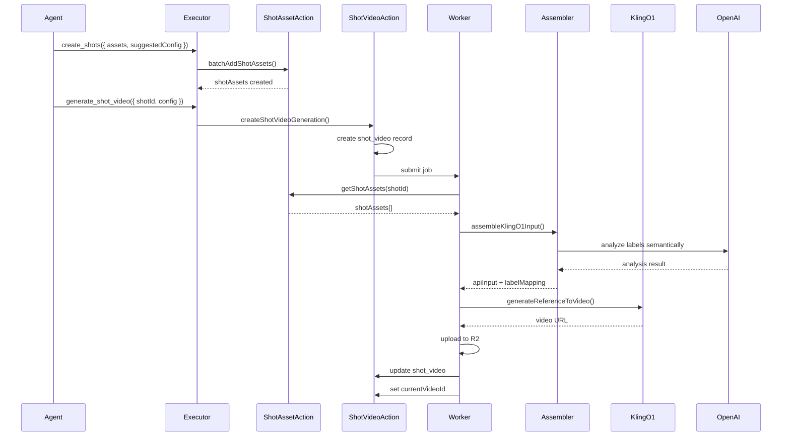

# Kling O1 视频生成系统重构 - 实现总结

## 完成状态

✅ **后端核心功能已全部实现完成**

⏸️ **UI 组件改造待后续迭代**（需要数据库迁移后进行）

## 已完成的工作

### 1. 数据库架构 ✅

**新增表结构：**

- `shot_asset`: 分镜关联素材表（多对多），支持语义化 label
- `shot_video`: 视频生成记录表（支持多版本）
- `shot_video_status`: 视频状态枚举

**Schema 更新：**
- `src/lib/db/schemas/project.ts` - 完整定义新表和关系
- 移除了 `shot.imageAssetId` 和 `shot.videoUrl`
- 添加了 `shot.currentVideoId` 指向当前使用的视频版本

### 2. 类型定义 ✅

**文件：** `src/types/project.ts`, `src/types/job.ts`

新增类型：
- `ShotAsset`, `NewShotAsset`
- `ShotVideo`, `NewShotVideo`
- `ShotAssetWithAsset` - 带完整 Asset 信息
- `ShotDetail` - 扩展支持 `shotAssets`, `currentVideo`, `shotVideos`

更新类型：
- `ShotVideoGenerationInput` - 新架构使用 `videoConfigId`

### 3. Kling O1 API 服务 ✅

**文件：** `src/lib/services/fal.service.ts`

实现功能：
- `KlingO1Element`, `KlingO1ReferenceToVideoInput` 类型定义
- `generateReferenceToVideo()` - 调用 Kling O1 Reference-to-Video API
- `queueReferenceToVideo()` - 队列方式提交
- 自动处理 R2 key 转换为公开 URL
- 支持 elements（角色一致性）、reference_images、start_frame

### 4. Label 语义理解引擎 ✅

**文件：** `src/lib/utils/kling-o1-assembler.ts`

核心功能：
- `assembleKlingO1Input()` - 主函数，组装 API 输入
- `analyzeLabelsSemantically()` - 调用 OpenAI API 理解 label
- `fallbackAnalysis()` - 降级方案（基于规则）
- 智能分组：
  - 起始帧识别（label 含 "首帧"/"start"）
  - 风格参考识别（label 含 "风格"/"style"）
  - 角色/物体元素识别（"{角色名}-主图"）
- Label 到 API 引用的映射（`@label` → `@Element1`, `@Image1`）

### 5. Server Actions ✅

#### ShotAsset 操作
**文件：** `src/lib/actions/project/shot-asset.ts`

- `addShotAsset()` - 添加单个关联
- `batchAddShotAssets()` - 批量添加
- `updateShotAssetLabel()` - 更新 label
- `removeShotAsset()` - 移除关联
- `reorderShotAssets()` - 重新排序
- `getShotAssets()` - 查询所有关联

#### ShotVideo 操作
**文件：** `src/lib/actions/project/shot-video.ts`

- `createShotVideoGeneration()` - 创建生成任务
- `getShotVideoHistory()` - 查询历史版本
- `setCurrentShotVideo()` - 设置当前版本
- `getCurrentShotVideo()` - 获取当前版本
- `deleteShotVideo()` - 删除版本
- `retryShotVideoGeneration()` - 重试失败任务

### 6. Worker 处理器 ✅

**文件：** `src/lib/workers/processors/video-processors.ts`

重构 `processShotVideoGeneration()`:
1. 从 `shot_video` 表读取配置
2. 查询 `shot_asset` 获取关联图片
3. 调用 `assembleKlingO1Input()` 进行 AI 组装
4. 调用 `generateReferenceToVideo()` 生成视频
5. 上传到 R2
6. 更新 `shot_video` 状态
7. 自动设置为 `currentVideoId`（如果 shot 还没有）

积分系统集成：
- 生成前扣费
- 失败退款
- 记录详细元数据

### 7. Agent Functions ✅

**文件：** `src/lib/actions/agent/functions.ts`, `executor.ts`

**更新的 Functions：**

1. `create_shots` - 扩展支持：
   - `assets` 数组：`[{ assetId, label }]`
   - `suggestedConfig`：`{ prompt, duration }`
   - Executor 实现自动调用 `batchAddShotAssets()`

2. **新增** `generate_shot_video`:
   - 参数：`shotId`, `config`（可选）
   - 自动读取分镜关联图片
   - 创建 `shot_video` 记录
   - 提交 job 任务
   - 返回 `jobId` 和 `videoConfigId`

3. `generate_videos` - 标记为废弃，保留向后兼容

## 数据流程



## 核心设计亮点

### 1. 数据与模型解耦
- 数据库存储原子事实（素材、label、关系）
- 不绑定 Kling O1 的 Element 结构
- 运行时动态组装，灵活应对 API 变化

### 2. AI 驱动的智能组装
- 使用 OpenAI 理解 label 语义
- 自动识别起始帧、风格参考、角色元素
- 降级方案确保稳定性

### 3. 版本化生成
- `shot_video` 表记录每次生成的完整配置
- 支持多版本对比
- 可重用配置、重试失败任务

### 4. 灵活的素材关联
- 分镜可关联多张图片（首帧、尾帧、关键帧、角色、场景、道具）
- 语义化 label 系统
- 支持临时添加额外素材

## 待完成工作

### UI 组件改造（待数据库迁移后）

需要创建/修改的组件：

1. **分镜编辑器扩展** (`shot-editor.tsx`)
   - 关联图片列表区域
   - 添加图片 + Label 编辑
   - Prompt 编辑器（支持 @label 自动补全）
   - 版本历史面板

2. **新组件**
   - `shot-asset-manager.tsx` - 管理分镜关联图片
   - `shot-video-history.tsx` - 视频版本历史

3. **交互流程**
   - 拖拽素材到分镜
   - 编辑 label
   - 调整顺序
   - 生成视频
   - 查看/切换版本

## 迁移步骤

### 数据库迁移（用户执行）

```sql
-- 1. 创建新表
CREATE TABLE shot_asset (...);
CREATE TABLE shot_video (...);

-- 2. 添加枚举
CREATE TYPE shot_video_status AS ENUM ('pending', 'processing', 'completed', 'failed');

-- 3. 更新 shot 表
ALTER TABLE shot ADD COLUMN current_video_id TEXT;
ALTER TABLE shot DROP COLUMN image_asset_id;
ALTER TABLE shot DROP COLUMN video_url;

-- 4. 运行 drizzle-kit push
npm run db:push
```

### 测试验证

1. **API 测试** - 调用 Kling O1 API
2. **Label 组装测试** - 验证 AI 理解
3. **端到端测试**：
   - Agent 创建分镜并关联图片
   - 生成视频
   - 查看版本历史

## 注意事项

1. **OPENAI_API_KEY 必须配置** - Label 组装引擎需要
2. **积分消耗** - Kling O1 可能费用更高，注意调整 `CREDIT_COSTS`
3. **提示词质量** - 详细的 prompt + 准确的 @label 引用 = 更好的视频
4. **降级策略** - AI 分析失败时会使用规则匹配

## 文件清单

### 新建文件
- ✅ `src/lib/utils/kling-o1-assembler.ts`
- ✅ `src/lib/actions/project/shot-asset.ts`
- ✅ `src/lib/actions/project/shot-video.ts`
- ⏸️ `src/components/projects/editor/preview-panel/shot-asset-manager.tsx`
- ⏸️ `src/components/projects/editor/preview-panel/shot-video-history.tsx`

### 修改文件
- ✅ `src/lib/db/schemas/project.ts` - 新表定义
- ✅ `src/lib/services/fal.service.ts` - Kling O1 API
- ✅ `src/lib/workers/processors/video-processors.ts` - 新处理逻辑
- ✅ `src/lib/actions/agent/functions.ts` - 新 functions
- ✅ `src/lib/actions/agent/executor.ts` - 新实现
- ✅ `src/types/project.ts` - 新类型
- ✅ `src/types/job.ts` - 更新输入类型
- ⏸️ `src/components/projects/editor/preview-panel/shot-editor.tsx` - UI 改造

## 总结

后端核心架构已完整实现，支持：
- ✅ 多图关联（shot_asset）
- ✅ Label 语义理解（AI）
- ✅ Kling O1 API 调用
- ✅ 版本化生成（shot_video）
- ✅ Agent 智能创建和生成
- ✅ Worker 自动化处理
- ✅ 积分系统集成

数据库迁移后即可进行端到端测试，UI 组件可渐进式迭代。

---

**实现日期**: 2024-12-28
**版本**: v1.0.0

