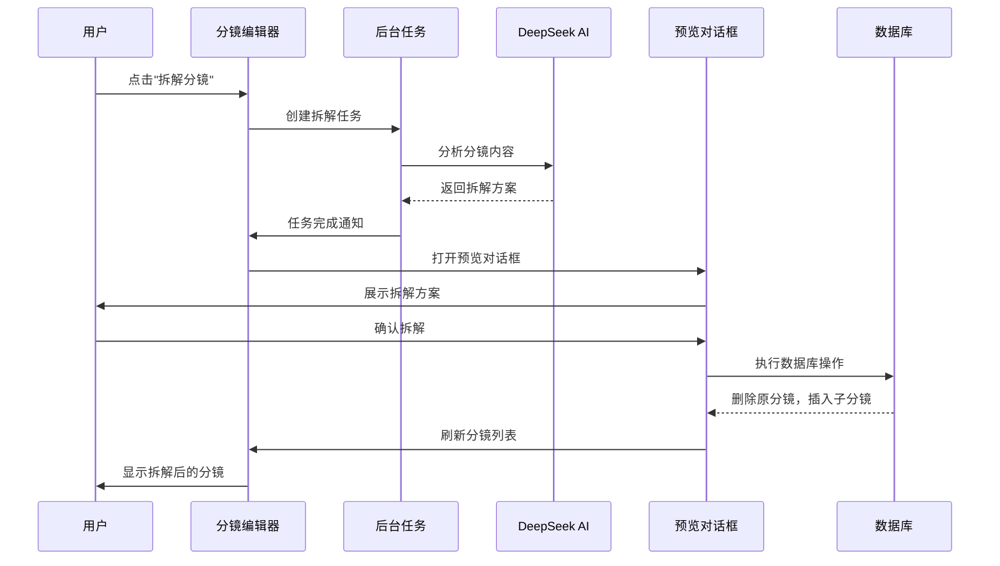

# 分镜拆解功能实现文档

## 功能概述

分镜拆解功能允许用户将包含多个对话或内容过于复杂的分镜，智能拆分为多个独立的小分镜。这个功能使用AI分析分镜内容，识别自然的拆分点，并为每个子分镜智能调整景别和视觉描述。

## 核心特性

- **AI驱动**: 使用DeepSeek AI的reasoning模式进行深度分析
- **自动识别拆分点**: 根据对话主体变化、情绪转折、动作变化等因素智能拆分
- **智能景别调整**: 为每个子分镜推荐合适的景别（如对话切换时用正反打）
- **后台任务处理**: 使用异步任务系统，不阻塞用户操作
- **预览确认**: 用户可以预览拆解方案后再决定是否导入

## 技术架构

### 1. 类型定义 (`src/types/job.ts`)

新增任务类型和接口：
- `JobType`: 添加 `shot_decomposition` 任务类型
- `ShotDecompositionInput`: 拆解任务输入数据
- `ShotDecompositionResult`: 拆解任务输出结果

### 2. AI Prompt设计 (`src/lib/prompts/shot.ts`)

- `buildShotDecompositionPrompt()`: 构建专门的分镜拆解Prompt
- 考虑因素：对话主体变化、情绪转折、动作变化、时间跨度
- 输出格式：JSON格式，包含拆解理由和子分镜列表

### 3. 后台任务处理器 (`src/lib/workers/processors/shot-decomposition.ts`)

- `processShotDecomposition()`: 核心拆解逻辑
- 使用DeepSeek reasoning模式进行深度分析
- 验证AI返回结果的合理性
- 结果存储在`job.resultData`中供预览

### 4. Server Actions

#### 创建拆解任务 (`src/lib/actions/storyboard/decompose-shot.ts`)
- `createShotDecompositionJob()`: 创建拆解任务
- 验证分镜是否需要拆解（至少2句对话或时长超过8秒）

#### 导入拆解结果 (`src/lib/actions/storyboard/import-decomposed-shots.ts`)
- `importDecomposedShots()`: 在数据库事务中执行导入
- 操作步骤：
  1. 删除原分镜及其关联数据
  2. 调整后续分镜的order
  3. 插入新的子分镜及其对话和角色
  4. 标记任务为已导入

### 5. UI组件

#### 分镜编辑器增强 (`src/components/projects/editor/preview-panel/shot-editor.tsx`)
- 添加"拆解分镜"按钮
- 条件显示：对话≥2句或时长≥8秒
- 监听任务进度并显示状态
- 任务完成后自动打开预览对话框

#### 拆解预览对话框 (`src/components/projects/editor/preview-panel/shot-decomposition-dialog.tsx`)
- 显示AI的拆解理由
- 展示拆解后的子分镜列表
- 每个子分镜显示：顺序号、景别、时长、对话内容、视觉描述
- 提供"确认拆解"和"取消"操作

### 6. 状态管理 (`src/components/projects/editor/editor-context.tsx`)

添加对话框状态管理：
- `shotDecompositionDialog`: 对话框状态
- `openShotDecompositionDialog()`: 打开对话框
- `closeShotDecompositionDialog()`: 关闭对话框

### 7. 任务配置 (`src/lib/workers/utils/timeout-handler.ts`)

- 超时时间：15分钟（考虑reasoning模式需要更多时间）

## 使用流程



## AI拆解策略

### 拆分判断因素
1. **对话主体变化**: A说完B说 → 建议正反打镜头
2. **情绪转折**: 平静→愤怒 → 建议景别变化
3. **动作变化**: 坐→站 → 建议新分镜
4. **时间跨度暗示**: "过了一会儿" → 拆分

### 景别智能调整
- **对话场景**: 交替使用中景(medium_shot)和特写(close_up)
- **动作场景**: 根据动作幅度选择全景或中景
- **情绪高潮**: 使用特写或大特写

### 时长分配
- 根据对话内容长度估算（约每秒3-4个汉字）
- 子分镜总时长应接近或略大于原分镜时长

## 数据库操作

### 拆解导入事务
```typescript
await db.transaction(async (tx) => {
  // 1. 获取原分镜信息（获取order）
  // 2. 调整后续分镜的order（+N-1，N为子分镜数量）
  // 3. 删除原分镜（级联删除dialogues和shotCharacters）
  // 4. 插入子分镜及其对话和角色关联
  // 5. 标记任务为已导入
});
```

## 注意事项

1. **数据一致性**: 使用数据库事务确保操作原子性
2. **任务幂等性**: 已导入的任务不能重复导入
3. **权限验证**: 验证用户对项目和分镜的访问权限
4. **错误处理**: 提供友好的错误提示和重试机制
5. **性能优化**: 拆解结果缓存在job.resultData中，可反复预览

## 文件清单

### 新建文件
- `src/lib/workers/processors/shot-decomposition.ts`
- `src/lib/actions/storyboard/decompose-shot.ts`
- `src/lib/actions/storyboard/import-decomposed-shots.ts`
- `src/components/projects/editor/preview-panel/shot-decomposition-dialog.tsx`
- `docs/shot-decomposition-feature.md`

### 修改文件
- `src/types/job.ts`
- `src/lib/prompts/shot.ts`
- `src/lib/workers/job-processor.ts`
- `src/components/projects/editor/preview-panel/shot-editor.tsx`
- `src/components/projects/editor/editor-context.tsx`
- `src/components/projects/editor/editor-layout.tsx`
- `src/lib/workers/utils/timeout-handler.ts`

## 后续优化方向

1. **智能建议**: 在时间轴上标记"建议拆解"的分镜
2. **手动调整**: 在预览对话框中允许用户手动合并/拆分子分镜
3. **批量拆解**: 支持一次性拆解选中的多个分镜
4. **撤销功能**: 允许撤销拆解操作，恢复原分镜
5. **拆解模板**: 预设常用的拆解模式（如对话场景、动作场景）
6. **统计分析**: 记录拆解效果，优化AI策略

## 测试建议

1. **基本拆解**: 包含3句对话的分镜 → 验证拆成3个单句分镜
2. **复杂场景**: 包含对话+动作描述 → 验证AI识别合理拆分点
3. **边界情况**: 只有1句对话的分镜 → 验证不显示拆解按钮
4. **任务失败**: 模拟AI调用失败 → 验证错误提示和重试机制
5. **并发处理**: 同时拆解多个分镜 → 验证任务队列正常运行
6. **数据一致性**: 验证拆解前后分镜order的正确性

## 版本历史

- **v1.0** (2024-12-15): 初始实现
  - AI驱动的分镜拆解
  - 预览确认机制
  - 后台任务处理
  - 数据库事务导入

