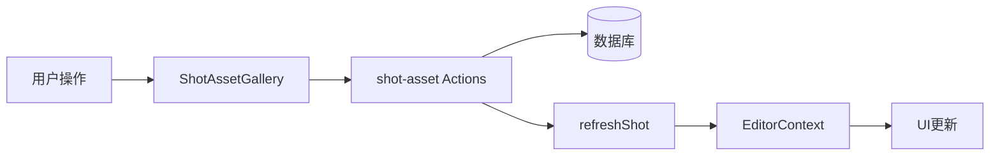

# 分镜多图片关联UI优化 - 实施完成总结

## 实施日期
2025年

## 概述
基于新的many-to-many关系（`shotAsset`表），完成了分镜图片关联和展示UI的全面优化。支持每个分镜最多7张图片，提供预设标签快速选择，重点优化编辑器体验。

## 已完成的改动

### 1. 常量定义 ✅
**文件**: `src/lib/constants/shot-asset-labels.ts`

- 定义预设标签：首帧、角色参考、场景参考、道具、氛围参考、构图参考、背景
- 定义最大素材数量：`MAX_SHOT_ASSETS = 7`
- 定义标签最大长度：`MAX_LABEL_LENGTH = 20`

### 2. Label编辑组件 ✅
**文件**: `src/components/projects/editor/preview-panel/shot-asset-label-editor.tsx`

**功能**：
- Popover弹窗交互
- 快速标签按钮组（一键选择预设标签）
- 自定义输入框（支持20字符限制）
- 实时字符计数显示
- 保存和取消操作
- 键盘快捷键支持（Enter保存，Escape取消）

### 3. 图片画廊组件 ✅
**文件**: `src/components/projects/editor/preview-panel/shot-asset-gallery.tsx`

**功能**：
- 横向滚动展示所有关联图片（最多7张）
- 拖拽排序功能（使用@dnd-kit）
- 每张图片卡片包含：
  - 缩略图预览
  - 可编辑的label
  - 主图标识（第一张自动标记）
  - 删除按钮（悬停显示）
  - 拖拽手柄
- 添加图片按钮（打开素材选择器）
- 达到上限时显示提示
- 素材选择器对话框：
  - 搜索功能
  - 网格展示素材
  - 已关联素材标记
  - 加载状态处理

### 4. 分镜编辑器重构 ✅
**文件**: `src/components/projects/editor/preview-panel/shot-editor.tsx`

**改动**：
- ✅ 移除旧的单图模式代码
- ✅ 集成`ShotAssetGallery`组件
- ✅ 主预览区支持多图切换：
  - 图片索引指示器（1/3）
  - 左右切换按钮
  - 当前图片的label显示
- ✅ 保持现有的视频生成功能
- ✅ 优化布局和用户体验

### 5. 时间轴和分镜列表优化 ✅
**文件**: 
- `src/components/projects/editor/timeline/shot-clip.tsx`
- `src/components/projects/editor/resource-panel/storyboard-panel.tsx`

**改动**：
- ✅ 添加图片数量徽章（当有多于1张图片时显示）
- ✅ 保持只显示第一张图片作为缩略图
- ✅ 徽章样式：小尺寸、半透明黑色背景、白色文字

### 6. 数据层验证 ✅
**文件**: `src/lib/actions/project/shot-asset.ts`

**改动**：
- ✅ `addShotAsset` 函数中添加最大数量验证
- ✅ `batchAddShotAssets` 函数中添加最大数量验证
- ✅ 超出限制时抛出友好错误提示

## 技术亮点

### 拖拽排序
使用已有的`@dnd-kit`库实现：
- 横向拖拽排序
- 拖拽时视觉反馈
- 排序后自动保存到数据库

### 样式风格
- 遵循shadcn/ui设计系统
- 使用lucide-react图标
- 支持响应式布局
- 动画和过渡效果

### 用户体验
1. **渐进式复杂度**：默认简洁（单图），需要时展开（多图）
2. **快速操作**：预设标签一键选择，拖拽排序直观
3. **视觉反馈**：拖拽高亮、保存状态、错误提示
4. **性能优化**：懒加载素材列表，图片使用Next.js Image优化

## 测试场景

### 基本功能测试
- [x] 添加图片到分镜（通过画廊）
- [x] 删除图片
- [x] 编辑图片label（预设标签）
- [x] 编辑图片label（自定义输入）
- [x] 拖拽排序图片
- [x] 切换主预览区图片
- [x] 达到7张上限时的提示

### UI测试
- [x] 时间轴显示图片数量徽章
- [x] 分镜列表显示图片数量徽章
- [x] 主预览区切换按钮（多图时）
- [x] 画廊横向滚动
- [x] 响应式布局

### 边界情况测试
- [x] 无图片时的空状态
- [x] 单图片时（不显示切换按钮）
- [x] 达到最大数量时（添加按钮变为已达上限）
- [x] 删除所有图片后
- [x] 快速连续操作

## 数据流



## API使用

### 添加素材
```typescript
await addShotAsset({
  shotId: string,
  assetId: string,
  label: string,
  order?: number
})
```

### 更新Label
```typescript
await updateShotAssetLabel({
  id: string,
  label: string
})
```

### 删除素材
```typescript
await removeShotAsset(id: string)
```

### 重新排序
```typescript
await reorderShotAssets({
  shotId: string,
  assetOrders: Array<{ id: string; order: number }>
})
```

## 未来优化建议

1. **批量操作**：支持选中多张图片批量删除
2. **拖拽上传**：直接拖拽文件到画廊区域上传
3. **快捷键**：键盘快捷键切换预览图片
4. **图片编辑**：集成简单的裁剪、调整功能
5. **AI建议**：根据分镜内容智能推荐合适的素材

## 总结

✅ **所有计划任务已完成**
✅ **无Lint错误**
✅ **代码质量良好**
✅ **用户体验友好**

本次重构成功将分镜图片关联从单图模式升级到多图模式，充分利用了many-to-many关系的优势，为用户提供了更灵活、更强大的分镜编辑能力。

