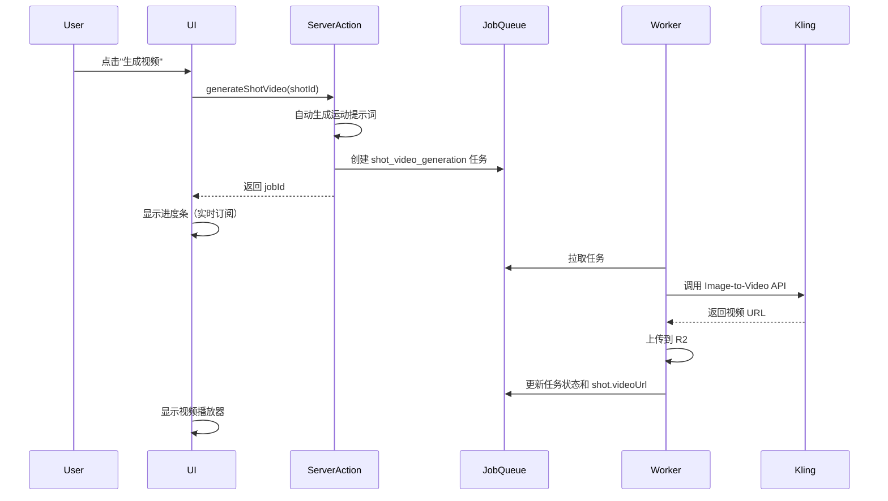

# 分镜视频生成功能实现总结

## 功能概述

实现了基于 Kling 模型的分镜视频生成功能，支持：
1. **单个分镜视频生成** - 在分镜编辑面板中生成单个视频
2. **批量视频生成** - 在时间轴工具栏中批量生成多个分镜视频

包括自动运动提示词生成和实时进度显示。

## 实现内容

### 1. Server Actions

**文件**: `src/lib/actions/video/generate.ts`

#### 单个视频生成
- `generateShotVideo(shotId)` - 创建单个视频生成任务
  - 验证用户权限
  - 检查分镜是否有图片
  - 自动生成运动提示词（基于 `cameraMovement`）
  - 自动选择视频时长（5秒/10秒）
  - 创建 `shot_video_generation` 类型的后台任务

#### 批量视频生成
- `batchGenerateShotVideos(shotIds[])` - 创建批量视频生成任务
  - 验证用户权限
  - 检查所有分镜
  - 创建 `batch_video_generation` 类型的父任务
  - Worker 会为每个分镜创建子任务

#### 其他
- `updateShotVideo(shotId, videoUrl)` - 手动更新视频 URL（备用）

### 2. 前端 UI

#### 2.1 单个分镜视频生成

**文件**: `src/components/projects/editor/preview-panel/shot-editor.tsx`

**新增状态管理**
- `isGeneratingVideo` - 跟踪视频生成状态
- `videoGenerationJobId` - 存储任务 ID
- `videoGenerationTasks` - 过滤视频生成任务

**新增函数**
- `handleGenerateVideo()` - 处理视频生成请求
  - 检查是否有图片
  - 调用 server action
  - 显示 toast 提示

**UI 更新**
在分镜编辑面板的图片预览下方添加了视频区域：

1. **无视频 + 有图片**: 显示"生成视频"按钮
2. **正在生成**: 显示进度条和实时进度信息
3. **有视频**: 显示视频播放器 + "重新生成"按钮

#### 2.2 批量视频生成

**文件**: `src/components/projects/editor/editor-layout.tsx`

**新增导入**
```typescript
import { batchGenerateShotVideos } from "@/lib/actions/video/generate";
```

**新增函数**
- `handleGenerateVideos()` - 处理批量视频生成
  - 检查是否选中分镜
  - 检查选中分镜是否都有图片
  - 调用批量生成 action
  - 显示 toast 提示

**UI 位置**
在时间轴工具栏中的"生成视频"按钮，选中分镜后点击即可批量生成。

### 3. 运动提示词自动生成

**文件**: `src/lib/utils/motion-prompt.ts`

- `buildVideoPrompt()` - 组装完整的视频提示词
  - 基于 `cameraMovement` 生成运镜描述
  - 结合 `visualPrompt` 视觉描述
  - 添加高质量设置

- `getKlingDuration()` - 自动选择视频时长
  - ≤5秒 → Kling 5秒模式
  - >5秒 → Kling 10秒模式

### 4. 后端处理器（已存在）

**文件**: `src/lib/workers/processors/video-processors.ts`

- `processShotVideoGeneration()` - 处理视频生成任务
  - 调用 Kling Video API
  - 上传视频到 R2 存储
  - 更新 `shot.videoUrl`

## 技术栈

- **视频生成**: Kling V2.6 Pro (via fal.ai)
- **任务队列**: 自定义 Job 系统
- **Worker**: 独立进程处理后台任务
- **存储**: Cloudflare R2

## 用户流程



## 运镜类型映射

| 运镜类型 | Kling 提示词 |
|---------|------------|
| static | camera stays completely still |
| push_in | smooth camera push in, moving closer |
| pull_out | smooth camera pull back, revealing more |
| pan_left/right | camera pans horizontally |
| tilt_up/down | camera tilts vertically |
| tracking | camera tracks subject movement |
| crane_up/down | camera cranes vertically |
| orbit | camera orbits around subject |
| zoom_in/out | camera zooms |
| handheld | dynamic handheld camera movement |

## 测试要点

### 单个视频生成
1. ✅ 无图片时点击生成视频 → 提示先生成图片
2. ✅ 有图片时点击生成 → 启动任务并显示进度
3. ✅ 实时进度更新
4. ✅ 生成完成后显示视频播放器
5. ✅ 重新生成功能
6. ✅ 不同运镜类型的提示词生成
7. ✅ 不同时长的视频生成（5秒/10秒）

### 批量视频生成
1. ✅ 未选中分镜时点击 → 提示先选择分镜
2. ✅ 选中有无图片混合的分镜 → 提示哪些分镜没有图片
3. ✅ 选中都有图片的分镜 → 启动批量任务
4. ✅ 创建父任务和多个子任务
5. ✅ 子任务独立执行，可以看到每个分镜的进度

## 相关文件

### 前端
- `src/lib/actions/video/generate.ts` - Server Actions (单个和批量)
- `src/components/projects/editor/preview-panel/shot-editor.tsx` - 单个视频生成 UI
- `src/components/projects/editor/editor-layout.tsx` - 批量视频生成 UI
- `src/components/projects/editor/timeline/timeline-toolbar.tsx` - 工具栏按钮

### 后端
- `src/lib/workers/processors/video-processors.ts` - Worker 处理器
- `src/lib/services/fal.service.ts` - Kling API 集成
- `src/lib/utils/motion-prompt.ts` - 提示词工具

### 类型定义
- `src/types/job.ts` - 任务类型定义

## 注意事项

1. 视频生成需要先有分镜图片（`imageUrl`）
2. Worker 进程必须运行才能处理任务
3. 需要配置 `FAL_KEY` 环境变量
4. Kling API 调用成本较高，建议添加用量限制
5. 视频生成时间较长（通常 30-60 秒），需要耐心等待

## 后续优化建议

1. 添加视频预览缩略图
2. 支持手动编辑运动提示词
3. 添加批量生成视频功能
4. 视频下载功能
5. 视频时长和分辨率自定义
6. 添加视频生成队列管理
7. 成本和用量统计

